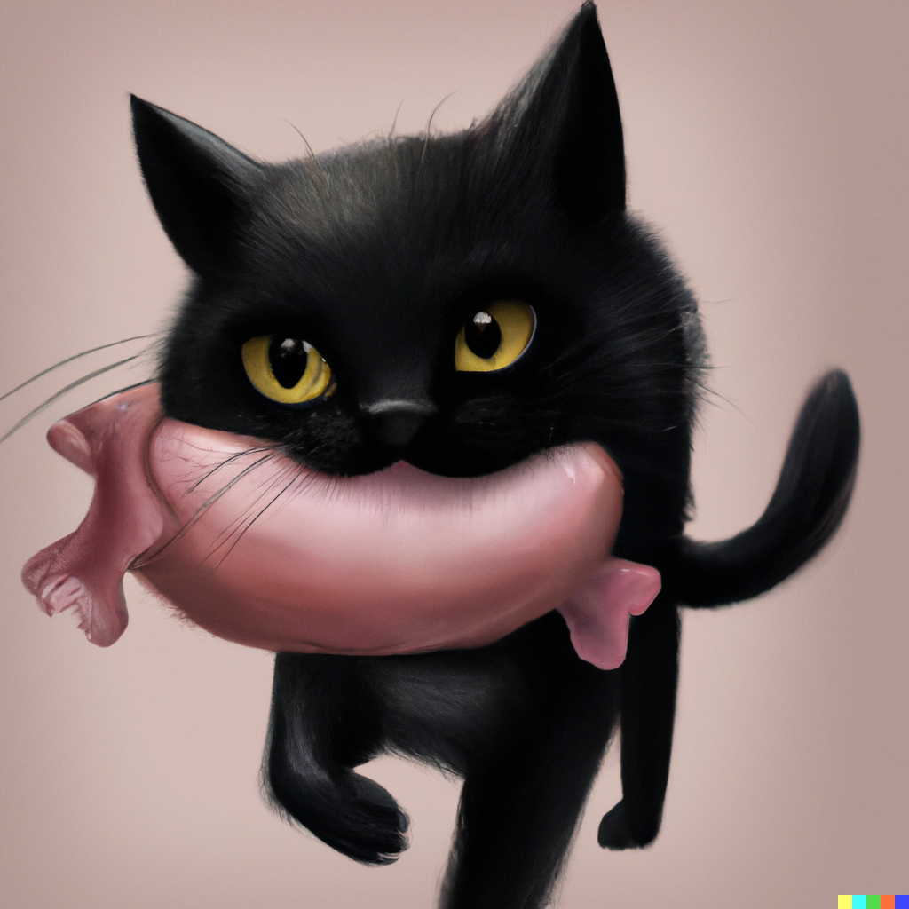

<a name="readme-top"></a>
[![Contributors][contributors-shield]][contributors-url]
[![Issues][issues-shield]][issues-url]

<!-- PROJECT LOGO -->
<br />
<div align="center">
  <a href="https://github.com/Merssith/Chobi-Negrito-Cocos">
    
  </a>

<h3 align="center">CHOBI NEGRITO LOVES HAM</h3>

  <p align="center">
    <br />
    <a href="https://github.com/Merssith/Chobi-Negrito-Cocos"><strong>Explore the docs »</strong></a>
    <br />
    <a href="https://github.com/Merssith/Chobi-Negrito-Cocos/issues">Report bug</a>
    ·
    <a href="https://github.com/Merssith/Chobi-Negrito-Cocos/issues">Request feature</a>
  </p>
</div>

<!-- TABLE OF CONTENTS -->
<details>
  <summary>Table of Contents</summary>
  <ol>
    <li>
      <a href="#about-the-proyect">About The Project</a>
      <ul>
        <li><a href="#built-with">Built With</a></li>
      </ul>
    </li>
    <li>
      <a href="#getting-started">Getting Started</a>
      <ul>
        <li><a href="#prerequisites">Prerequisites</a></li>
        <li><a href="#installation">Installation</a></li>
      </ul>
    </li>
    <li><a href="#roadmap">Roadmap</a></li>
    <li><a href="#contributing">Contributing</a></li>
    <li><a href="#contact">Contact</a></li>
  </ol>
</details>

<!-- ABOUT THE PROJECT -->

## About The Proyect

<p align="center"></p>

This is a simple video game developed in Cocos Creator and Typescript.
The cat (Chobi Negrito) must collect all the ham that she can. However this is an endless game, therefore you can spend hours collecting ham!.<br/>
The project is currently in the development phase. I'll show you more when some bugs have been fixed. You can see more about them in the RoadMap section ;)

<p align="right">(<a href="#readme-top">back to top</a>)</p>

### Built With

- Cocos Creator 3.6
- Typescript

<p align="right">(<a href="#readme-top">back to top</a>)</p>

<!-- GETTING STARTED -->

## Getting Started

This project is not yet deployed, but you can try it in your local. Follow the instructions below to run it.

### Prerequisites

You must have Cocos Creator installed on your computer. You can do it from here: https://www.cocos.com/en . This project is made with version 3.6

### Installation

1. Clone the repo
   ```sh
   git clone https://github.com/Merssith/Chobi-Negrito-Cocos
   ```
2. Open Cocos Creator Dashboard
3. Add a proyect
4. Choose the folder called Cocos that is inside this repository
5. Have fun!

<p align="right">(<a href="#readme-top">back to top</a>)</p>

<!-- ROADMAP -->

## Roadmap

Next updates:

- [ ] Ham: Gathering ham is currently not working. It will be fixed in the next update
- [ ] Animations: Add more animations for more fluid movement: walk, jump drop
- [ ] Start screen: start screen will be added to start the game
- [ ] Score counter and overall score
- [ ] End the game: Fall of the platforms or end the game manually

<p align="right">(<a href="#readme-top">back to top</a>)</p>

<!-- CONTRIBUTING -->

## Contributing

<p>Contributions from the Dev community help us learn, be inspired, and create new things! All contributions are welcome!</p>
<p>If you have any suggestions to improve our project, please fork the repository and create a pull request. Or You can open an issue.</p>
<p>Thanks again!</p>

1. Fork the Project
2. Create your Feature Branch (`git checkout -b feature/MyFeature`)
3. Commit your Changes (`git commit -m 'Add MyFeature'`)
4. Push to the Branch (`git push origin feature/MyFeature`)
5. Open a Pull Request

<p align="right">(<a href="#readme-top">back to top</a>)</p>

<!-- CONTACT -->

## Contact

- Mercedes Salcedo » [Email](mailto:mercedes.salcedo1989@gmail.com) - [LinkedIn](https://www.linkedin.com/in/mercedessalcedojobs/)

Project Link: [https://github.com/Merssith/Chobi-Negrito-Cocos](https://github.com/Merssith/Chobi-Negrito-Cocos)

<p align="right">(<a href="#readme-top">back to top</a>)</p>

[contributors-shield]: https://img.shields.io/github/contributors/Merssith/Chobi-Negrito-Cocos.svg?style=for-the-badge
[contributors-url]: https://github.com/Merssith/Chobi-Negrito-Cocos/graphs/contributors
[issues-shield]: https://img.shields.io/github/issues/Merssith/Chobi-Negrito-Cocos.svg?style=for-the-badge
[issues-url]: https://github.com/Merssith/Chobi-Negrito-Cocos/issues
